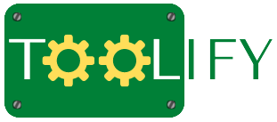

# Welcome to Toolify


Toolify is a web application written in Python,
using the Flask web framework and the Spotify API wrapper library, Spotipy.

With Toolify, you can manage your playlists with several features
that you can't get from the official Spotify client.

# Setup local environment
1. Install dependencies:
```shell
task install
```
2. Copy .env-sample to .env and fill it with the required environment variables.
3. Now, you can launch the application by executing:
```shell
task start
```
4. Finally, you can stop the application by executing:
```shell
task stop
```
> 💡 All available commands can be list executing `task`

# Other tips for development
You can launch the test suite by executing:
```shell
task test
```

